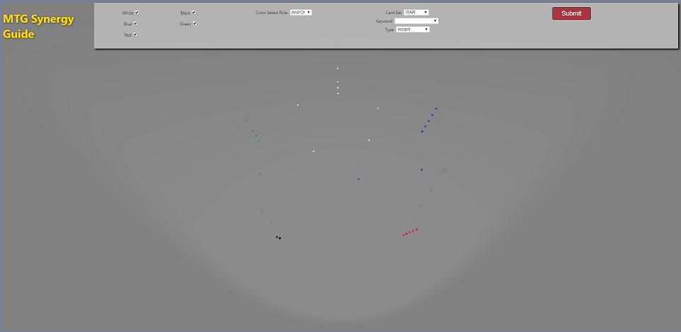
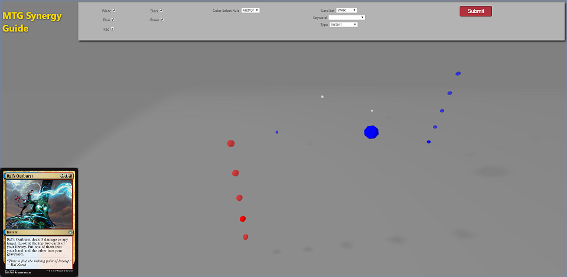

# MTG-Visualizer

## Overview

A web app to display relationships between cards from Magic: The Gathering that (may) have positive synergy with each other based on card properties and the game mechanics that they interact with.

Users can enter search criteria (including colors, keywords, type, and sets) which is used to filter card data (provided by magicthegathering.io's API) and then display related cards. Search results are displayed in a 3D space with each card represented as an "orb", floating in a position determined by it's Color Identity (as defined in api.maginthegathering.io) and Converted Mana Cost as shown below.

When a card is selected by the user, the displayed "orbs" are filtered based upon their "synergy" with the selected card, leaving only "synergistic" cards.

The app is built in React and uses ThreeJS to display a 3D data field in which the user can navigate through and examine the card results. The "cards" are first rendered as orbs located at various points throughout the 3D scene, which are positioned according to their relationship with each the other "cards". This gives the user a visual reference for the amount of "synergy" between cards.

## Future Improvements

- Implement _Color_ filter functionality (currently not working)
- Implement _Keyword_ filter functionality (currently not working)
- Change ThreeJS _OrbitControls_ to _FlyControls_ (or similar variant) to improve UX
- Add 2+ color mana textures to orbs (currently only using single-color textures, forcing multicolor cards to be shown with only one of their colors as its texture).
- Redesign Plane component (i.e. add thematic texture(s), and possibly 3D models)
- Add ability to select multiple orbs at once for additional card analysis
- Add UI elements that display key synergy-related data about selected card(s)

### Decklist Import

In the future, could add a Decklist Import feature to allow users to upload decklists and have a visual reference for the relationships between the cards in their decks. This feature could also include a graph displaying the deck's Mana Curve and other deck information.

## Setup

### Frontend (ReactJS)

- Install dependencies: `npm install`
- Start app: `npm run dev`

### Server (Flask/Python)

- Change directory to server and setup Python virtual environment: `cd ./server`
  - On MacOS/Linux:
    - `python3 -m venv venv`
    - `source venv/bin/activate`
  - On Windows:
    - `python -m venv venv`
    - `source venv/Scripts/activate`
- Install dependencies: `pip install -r requirements.txt`
- Start server: `npm run server`
